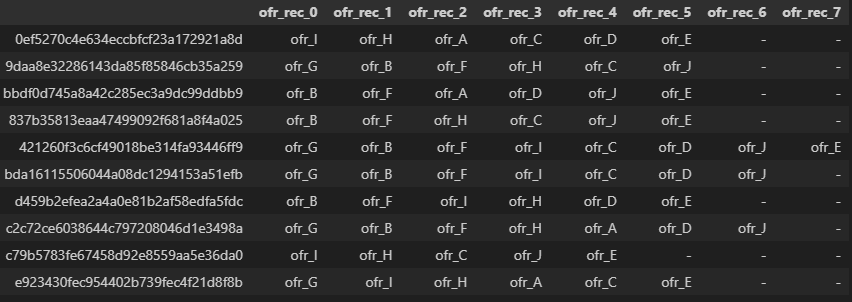
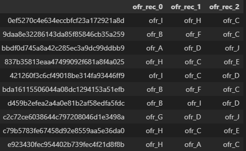
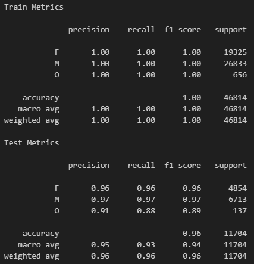
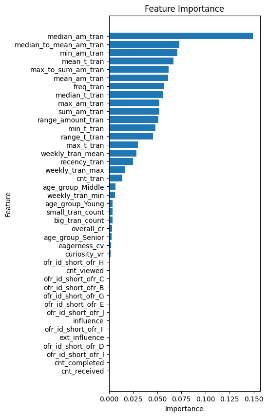
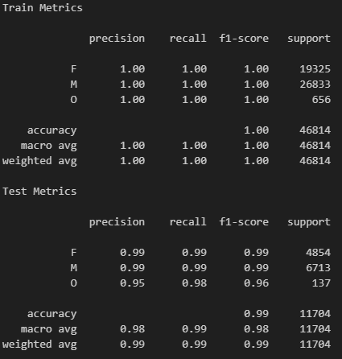
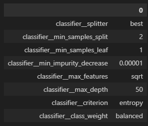

# Starbucks Project

Applying data science and machine learning techniques to analyze Starbucks customer behavior and create offer recommendations.

## **Project Overview**

### **Objective**
The goal of this project is to develop two **Recommendation Engines** to suggest offers based on customer segmentation. The following approaches were implemented and evaluated:

- **Engine 1:** Rank-Based Recommendations
- **Engine 2:** User-User Collaborative Filtering

Additionally, a classification model using a **Decision Tree Classifier** was developed to predict attributes such as gender, age group, and offer acceptance. **Feature engineering** was extensively performed, and multiple feature sets were tested to determine the most effective predictors.

### **Evaluation Metrics**
- The recommendation engines were optimized to deliver relevant offers to customers.
- Model selection and tuning were performed using cross-validation.
- The **F1-macro score** was used as the primary metric for model evaluation, ensuring better class-wise performance assessment. The models were validated using a separate test dataset.

## **Project Structure**

### **Files:**
- `recommendations_engines.ipynb`: Implements recommendation engines.
- `feature_engineering.ipynb`: Exploratory Data Analysis (EDA) and feature engineering.
- `functions.py`: Collection of utility functions.
- `README.md`: Project documentation.
- `visualizing.py`: Generates visualizations and insights from stored datasets.
- `requirements.txt`: List of required Python libraries.

> Note: The first two notebooks generate tables stored in dedicated folders.

### **Folders:**
- `../data`: Contains the original `.json` files from Starbucks.
- `../medalon_data_store`: Stores tables generated by feature engineering and recommendation notebooks (`tables_catalog.ipynb` provides an overview).
- `../models_pipeline`: Contains scripts for model training, evaluation, and validation.
- `../saved_models`: Stores serialized models (`.pkl` files) for future use.

## **Analysis and Feature Engineering**

### **Exploratory Data Analysis (EDA)**
- Descriptive statistics were used to analyze datasets and identify anomalies.
- Cleaning and transformation steps were applied to normalize and structure the data appropriately.

### **Data Visualization**
- Various visualization techniques were employed to understand feature relationships, customer segmentation, and offer effectiveness.
- The visualizations are consolidated in `visualizing.py` to maintain a clean notebook structure.

## **Methodology**

### **Data Preprocessing**
- Addressed missing values and inconsistent categories.
- Created structured tables and engineered meaningful features for recommendation engines and classification models.
- Processed datasets were saved in the `medalon_data_store` folder.

### **Implementation**
- Two recommendation engines were implemented to generate personalized offers.
- Three classification pipelines were built for customer segmentation, and an additional pipeline was developed for churn prediction.
- Recommendations and models are stored in dedicated files for modularity and reusability.

## **Results**

### **Recommendation Engines**

#### **Rank-Based Recommendations**
- A straightforward approach ranking offers based on selected features (e.g., `view_ratio`, `comp_ratio`).
- Customers receive ranked recommendations for unseen offers.

Example output (top 10 customers):

#### **User-User Collaborative Filtering**
- Recommends offers based on customer interaction similarity (cosine similarity).
- Generates a user-item matrix to compute recommendations.

Example output:

### **Model Evaluation and Validation**

- The `train_pipeline_gender.py` script predicts gender using engineered features.
- Classification report and confusion matrix results are available in the pipeline files.

Baseline model performance:

Feature importance visualization:

After selecting the top features (cumulative importance > 70%), the model was fine-tuned:

## **Conclusion**

### **Key Findings**

#### **Recommendations:**
- The Rank-Based model effectively recommends offers based on predefined ranking criteria.
- The User-User Collaborative Filtering model incorporates demographic and behavioral data for improved personalization.

#### **Classification Models:**
- Gender and age group predictions performed well.
- Offer prediction models did not yield satisfactory results, suggesting deeper behavioral patterns not captured by feature engineering.
- The `curiosity_vr` feature emerged as a significant predictor for offers but was insufficient for robust prediction.

Feature importance for offer prediction:

### **Future Improvements**
- Further refinement of feature engineering.
- Experimentation with hybrid recommendation models.
- Exploration of deep learning techniques for offer prediction.
- Additional customer segmentation methods to enhance recommendation accuracy.

This project demonstrates the power of data science in solving real-world problems through structured analysis, modeling, and evaluation.

