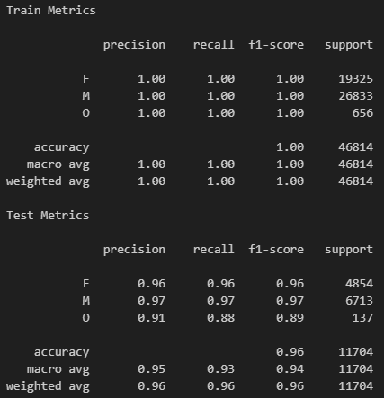
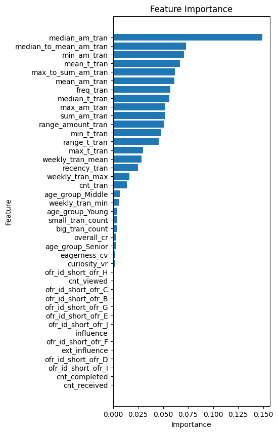
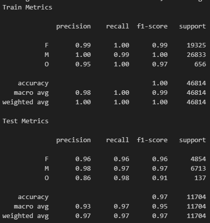
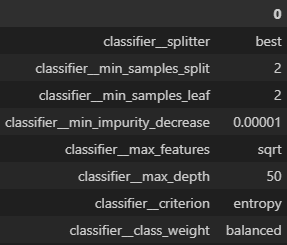
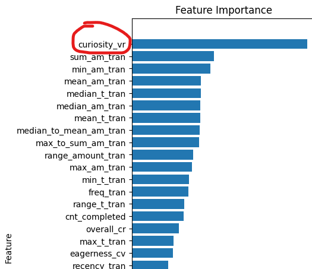

# Starbucks Project

Applying data science and machine learning techniques to analyze Starbucks customer behavior and create offer recommendations and machine learn models.

## **Project Overview**

### **Objective**
The goal of this project is to develop two **Recommendation Engines** to suggest offers based on ranked items and user interactions. The following approaches were implemented:

- **Engine 1:** Rank-Based Recommendations
- **Engine 2:** User-User Collaborative Filtering

Additionally, a classification model using a **Decision Tree Classifier** was developed to predict attributes such as gender, age group, and offer acceptance. **Feature engineering** was extensively performed, and multiple feature sets were tested to determine the most effective predictors.

> An article was publishe in the Medium blog post: https://medium.com/@niltonjuniorphd/coffee-cheers-using-data-science-and-machine-learning-to-decode-starbucks-customer-behaviour-7d1c81777eae 

### **Evaluation Metrics**
- The recommendation engines were optimized to deliver relevant offers to customers.
- Model selection and tuning were performed using cross-validation.
- The **F1-macro score** was used as the primary metric for model evaluation, ensuring better class-wise performance assessment. The models were validated using a separate test dataset.

## **Project Structure**

> Python version 3.13.0

### **Files:**
- `recommendations_engines.ipynb`: Implements recommendation engines.
- `feature_engineering.ipynb`: Exploratory Data Analysis (EDA) and feature engineering.
- `functions.py`: Collection of utility functions.
- `README.md`: Project documentation.
- `visualizing.ipynb`: Generates visualizations and insights from stored datasets.
- `requirements.txt`: List of required Python libraries.

> Note: The first two notebooks generate tables stored in dedicated folders.

### **Folders:**
- `../data`: Contains the original `.json` files from Starbucks.
- `../medalon_data_store`: Stores tables generated by feature engineering and recommendation notebooks (`tables_catalog.ipynb` provides an overview).
- `../models_pipeline`: Contains scripts for model training, evaluation, and validation.
- `../saved_models`: Stores serialized models (`.pkl` files) for future use.

## **Analysis and Feature Engineering**

### **Exploratory Data Analysis (EDA)**
- Descriptive statistics were used to analyze datasets and identify anomalies.
- Cleaning and transformation steps were applied to normalize and structure the data appropriately.

### **Data Visualization**
- Various visualization techniques were employed to understand feature relationships, customer segmentation, and offer effectiveness.
- The visualizations are consolidated in `visualizing.ipynb` to maintain a clean notebook structure.

## **Methodology**

### **Data Preprocessing**
- Addressed missing values and inconsistent categories.
- Created structured tables and engineered meaningful features for recommendation engines and classification models.
- Processed datasets were saved in the `medalon_data_store` folder.

### **Implementation**
- Two recommendation engines were implemented to generate personalized offers.
- Three classification pipelines were built for customer segmentation, and an additional pipeline was developed for churn prediction.
- Recommendations and models are stored in dedicated files for modularity and reusability.

## **Results**

### **Recommendation Engines**

#### **Rank-Based Recommendations**
- A straightforward approach ranking offers based on selected features (e.g., `view_ratio`, `comp_ratio`).
- Customers receive ranked recommendations for unseen offers.

Example output (recomendations unseen offers for 10 customers):

|                                  | ofr_rec_0   | ofr_rec_1   | ofr_rec_2   | ofr_rec_3   | ofr_rec_4   | ofr_rec_5   | ofr_rec_6   |
|:---------------------------------|:------------|:------------|:------------|:------------|:------------|:------------|:------------|
| 42de30f65a554db2b2928ab318de7390 | ofr_G       | ofr_B       | ofr_F       | ofr_I       | ofr_H       | ofr_C       | ofr_D       |
| d3c01d3f66d142df959c19fb8bef8af9 | ofr_G       | ofr_B       | ofr_I       | ofr_H       | ofr_A       | ofr_D       | -           |
| 02e2211319524b9e8bd09794d00d8513 | ofr_G       | ofr_B       | ofr_I       | ofr_C       | ofr_J       | ofr_E       | -           |
| 1a43f12c497f4ea0aa3897252b84d3dd | ofr_G       | ofr_F       | ofr_H       | ofr_A       | ofr_C       | ofr_D       | ofr_J       |
| 25c89cd833a04d51b76510b1ae335476 | ofr_B       | ofr_F       | ofr_I       | ofr_C       | ofr_D       | ofr_E       | -           |
| 3504fbcd34474688ac705a18dbf6f9f9 | ofr_B       | ofr_F       | ofr_I       | ofr_H       | ofr_J       | ofr_E       | -           |
| 9d9762e2f526402aa214e18be86ecb0f | ofr_G       | ofr_I       | ofr_H       | ofr_D       | ofr_J       | ofr_E       | -           |
| cd0cb9d1599c47a0bb69c49d19c2117f | ofr_G       | ofr_F       | ofr_H       | ofr_A       | ofr_C       | ofr_E       | -           |
| e2a8952a0a504021995b8c609ebd6ded | ofr_G       | ofr_I       | ofr_H       | ofr_A       | ofr_J       | ofr_E       | -           |
| 2e792741fcd548889f45c3399a1d6f69 | ofr_B       | ofr_H       | ofr_A       | ofr_C       | ofr_E       | -           | -           |

#### **User-User Collaborative Filtering**
- Recommends offers based on customer interaction similarity (cosine similarity).
- Generates a user-item matrix to compute recommendations.

Example output:

|                                  | ofr_rec_0   | ofr_rec_1   | ofr_rec_2   |
|:---------------------------------|:------------|:------------|:------------|
| 42de30f65a554db2b2928ab318de7390 | ofr_I       | ofr_D       | ofr_B       |
| d3c01d3f66d142df959c19fb8bef8af9 | ofr_G       | ofr_B       | ofr_H       |
| 02e2211319524b9e8bd09794d00d8513 | ofr_J       | ofr_E       | ofr_C       |
| 1a43f12c497f4ea0aa3897252b84d3dd | ofr_D       | ofr_J       | ofr_C       |
| 25c89cd833a04d51b76510b1ae335476 | ofr_F       | ofr_I       | ofr_E       |
| 3504fbcd34474688ac705a18dbf6f9f9 | ofr_E       | ofr_B       | ofr_H       |
| 9d9762e2f526402aa214e18be86ecb0f | ofr_D       | ofr_E       | ofr_H       |
| cd0cb9d1599c47a0bb69c49d19c2117f | ofr_G       | ofr_F       | ofr_E       |
| e2a8952a0a504021995b8c609ebd6ded | ofr_G       | ofr_A       | ofr_H       |
| 2e792741fcd548889f45c3399a1d6f69 | ofr_B       | ofr_H       | ofr_C       |

### **Model Evaluation and Validation**

 - The complete validation strategy can be seen in the model dedicated file in the `model_pipelines` folder. The exemple below shows results from the `train_pipeline_gender.py`, dedicated to predict the gender of a customer using engineered features.  Classification Reports Metrics and Confusion Matrix results are available in the pipeline files. 

As a exemple, using the pipeline `train_pipeline_gender.py` and the table `user_event_transactions`, stored in the `'../medalion_data_store/gold/user_event_transactions.csv'`, it can be seen the folowing results for a Decision Tree Classifier:

**Baseline model performance:**

Feature importance visualization from baseline model:

To predict gender, the customers properties from transactions `amount` and `time` are most importatnt than features from events interactions. After selecting the top features (cumulative importance > 70%), the model was fine-tuned:

 

## **Conclusion**

### **Key Findings**

#### **Recommendations:**
- The Rank-Based model effectively recommends offers based on predefined ranking criteria.
- The User-User Collaborative Filtering model incorporates demographic and behavioral data because the table used to calculate similarity contains segment gender and age group beside transactions and events for each customer in the data base.

#### **Classification Models:**
- Gender and age group predictions performed well.
- Offer prediction models did not yield satisfactory results, suggesting deeper behavioral patterns not captured by feature engineering.
- The `curiosity_vr` feature, **a carefully math derived feature**, emerged as a significant predictor for offers but was insufficient for robust prediction. This feature measure the *time-intensity* that a custumer tends to visualise an offer after received. The transactions properties had the most importance again.

Feature importance for offer prediction:

### **Future Improvements**
- Further refinement of feature engineering.
- Experimentation with hybrid recommendation models.
- Exploration of deep learning techniques for offer prediction.
- Additional customer segmentation methods to enhance recommendation accuracy.

This project demonstrates the power of data science in solving real-world problems through structured analysis, modeling, and evaluation.

